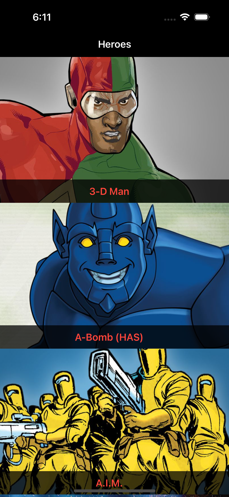
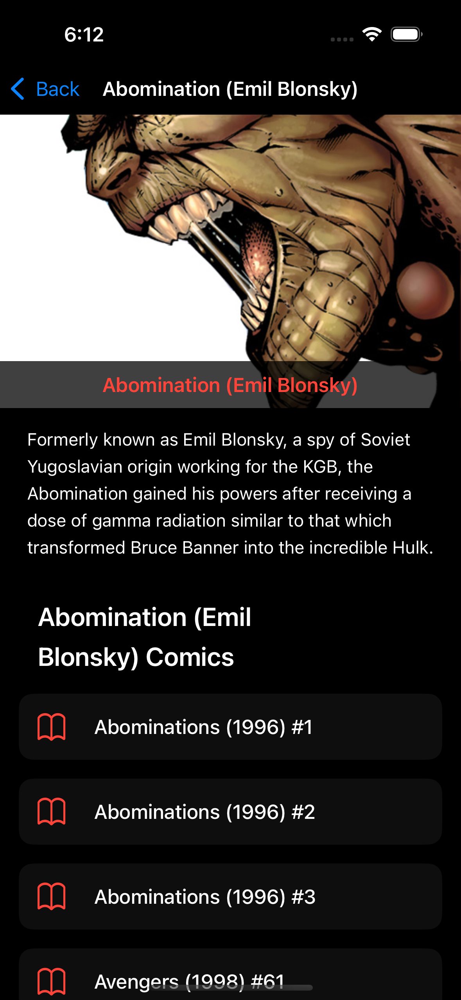

# 🦸‍♀️ Marvel Explorer

Marvel Explorer is a Swift-based iOS app that showcases Marvel characters using the official [Marvel API](https://developer.marvel.com/). Built with a scalable MVVM architecture, the app ensures clean separation of concerns, easy testing, and modern development practices.

## ✨ Features

- 🔍 Browse Marvel characters with images and names
- 📄 View detailed information about each hero
- ✅ Written test cases using Apple’s new **Swift Testing** framework
- 📏 Enforced code style with **SwiftLint**
- 🤖 Automated **GitHub Actions** for linting and testing

## 🛠️ Tech Stack

- **Swift 5+**
- **SwiftUI** + **Combine**
- **MVVM Architecture**
- **Swift Testing Framework (Xcode 15+)**
- **SwiftLint**
- **GitHub Actions (CI)**

## 📸 Screenshots

| Home Screen | Detail Screen | 
|:---------:|:----------------:|
|  |  |

## 🔐 Marvel API Setup

1. Get your keys from [Marvel Developer Portal](https://developer.marvel.com/).
2. Create a file `Secrets.swift`:

```swift
struct Secrets {
    static let publicKey = "your_public_key"
    static let privateKey = "your_private_key"
}
